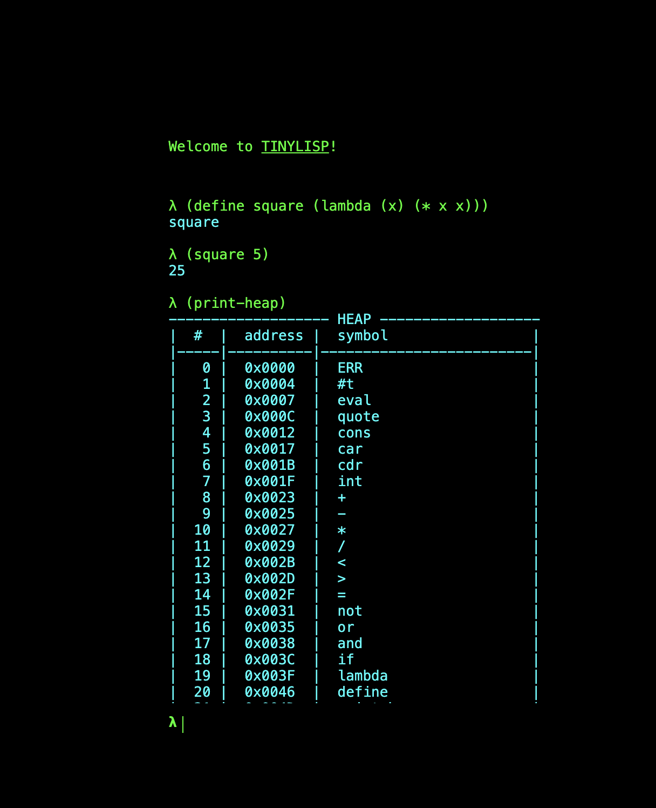

# tinylisp

Play with tinylisp at: https://daneelsan.github.io/tinylisp/

tinylisp is a minimal Lisp interpreter implemented in Zig, using NaN boxing for efficient memory representation. It supports core Lisp features like atoms, lists, conditionals, arithmetic, and closures, along with an interactive REPL and debugging tools for inspecting the heap, stack, and environment.



## Documentation

### Atoms

`#t` (True):
```lisp
λ #t
#t
```

`ERR` (Error):
```lisp
λ (cdr 42)
ERR
```

### Arithmetic

`+` (Addition):
```lisp
λ (+ 1 2 3 4)
10
```

`-` (Subtraction):
```lisp
λ (- 10 2 3)
5
```

`*` (Multiplication):
```lisp
λ (* 2 3 4)
24
```

`/` (Division):
```lisp
λ (/ 3.4 4)
0.85
```

### Structural

`car`:
```lisp
λ (car '(1 2 3))
1
```

`cdr`:
```lisp
λ (cdr '(1 2 3))
(2 3)
```

`cons`:
```lisp
λ (cons 1 2)
(1 . 2)
```
```lisp
λ (cons 1 '(2 3))
(1 2 3)
```

### Quoting and Evaluation

`'` (Quoting):
```lisp
λ '(+ 1 2 3)
(+ 1 2 3)
```

`eval` (Evaluation):
```lisp
λ (eval '(+ 1 2 3))
6
```


### Conditionals and Logic

`if`:
```lisp
λ (if (< 1 2) 'true 'false)
true
```

`and`:
```lisp
λ (and (< 1 2) (< 2 3))
#t
```
```lisp
λ (and (< 2 1) (< 2 3))
()
```

`or`:
```lisp
λ (or (< 1 2) (< 3 2))
#t
```

`not`:
```lisp
λ (not (< 1 2))
()
```

`=` (Equality):
```lisp
λ (= 1.0 1)
#t
```
```lisp
λ (= 1.1 1)
()
```

### Lambdas and Closures

`lambda`:
```lisp
λ ((lambda (x) (* x x)) 5)
25
```

`define`:
```lisp
λ (define square (lambda (x) (* x x)))
square
```
```lisp
λ (square 5)
25
```

```lisp
λ (define x 42)
x
```
```lisp
λ (+ x x)
84
```

### Debugging and Introspection

`echo`:
```lisp
λ (+ (echo (* 3 4) 5))
    >> 12
12
```

`echo-eval`:
```lisp
λ (echo-eval (+ (* 3 4) 5))
    >> ((+ (* 3 4) 5))
    << 17
17
```

`print-env`:
```lisp
λ (print-env)
(
	(echo-eval . «echo-eval»)
	(echo . «echo»)
	(print-env . «print-env»)
	(print-stack . «print-stack»)
	(print-heap . «print-heap»)
	(define . «define»)
	(lambda . «lambda»)
	(if . «if»)
	(and . «and»)
	(or . «or»)
	(not . «not»)
	(= . «=»)
	(> . «>»)
	(< . «<»)
	(/ . «/»)
	(* . «*»)
	(- . «-»)
	(+ . «+»)
	(int . «int»)
	(cdr . «cdr»)
	(car . «car»)
	(cons . «cons»)
	(quote . «quote»)
	(eval . «eval»)
	(#t . #t)
)
()
```

`print-heap`:
```lisp
λ (print-heap)
------------------- HEAP -------------------
|  #  |  address |  symbol                 |
|-----|----------|-------------------------|
|   0 |  0x0000  |  ERR                    |
|   1 |  0x0004  |  #t                     |
|   2 |  0x0007  |  eval                   |
|   3 |  0x000C  |  quote                  |
|   4 |  0x0012  |  cons                   |
|   5 |  0x0017  |  car                    |
|   6 |  0x001B  |  cdr                    |
|   7 |  0x001F  |  int                    |
|   8 |  0x0023  |  +                      |
|   9 |  0x0025  |  -                      |
|  10 |  0x0027  |  *                      |
|  11 |  0x0029  |  /                      |
|  12 |  0x002B  |  <                      |
|  13 |  0x002D  |  >                      |
|  14 |  0x002F  |  =                      |
|  15 |  0x0031  |  not                    |
|  16 |  0x0035  |  or                     |
|  17 |  0x0038  |  and                    |
|  18 |  0x003C  |  if                     |
|  19 |  0x003F  |  lambda                 |
|  20 |  0x0046  |  define                 |
|  21 |  0x004D  |  print-heap             |
|  22 |  0x0058  |  print-stack            |
|  23 |  0x0064  |  print-env              |
|  24 |  0x006E  |  echo                   |
|  25 |  0x0073  |  echo-evaluation        |
|                    ...                   |
--------------------------------------------
()
```

`print-stack`:
```lisp
λ (print-stack)
------------- STACK ------------
|  pointer |   tag  |  ordinal |     Expr
|----------|--------|----------|--------------
|    1024  |  ATOM  |  0x0004  |  #t
|    1023  |  ATOM  |  0x0004  |  #t
|    1022  |  CONS  |    1022  |
|    1021  |  NIL   |       0  |  ()
|    1020  |  ATOM  |  0x0007  |  eval
|    1019  |  PRIM  |       0  |  «eval»
|    1018  |  CONS  |    1018  |
|    1017  |  CONS  |    1020  |
|    1016  |  ATOM  |  0x000C  |  quote
|    1015  |  PRIM  |       1  |  «quote»
|    1014  |  CONS  |    1014  |
|    1013  |  CONS  |    1016  |
|    1012  |  ATOM  |  0x0012  |  cons
|    1011  |  PRIM  |       2  |  «cons»
|    1010  |  CONS  |    1010  |
|    1009  |  CONS  |    1012  |
|    1008  |  ATOM  |  0x0017  |  car
|    1007  |  PRIM  |       3  |  «car»
|    1006  |  CONS  |    1006  |
|    1005  |  CONS  |    1008  |
|    1004  |  ATOM  |  0x001B  |  cdr
|    1003  |  PRIM  |       4  |  «cdr»
|    1002  |  CONS  |    1002  |
|    1001  |  CONS  |    1004  |
|    1000  |  ATOM  |  0x001F  |  int
|     999  |  PRIM  |       5  |  «int»
|     998  |  CONS  |     998  |
|     997  |  CONS  |    1000  |
|     996  |  ATOM  |  0x0023  |  +
|     995  |  PRIM  |       6  |  «+»
|     994  |  CONS  |     994  |
|     993  |  CONS  |     996  |
|     992  |  ATOM  |  0x0025  |  -
|     991  |  PRIM  |       7  |  «-»
|     990  |  CONS  |     990  |
|     989  |  CONS  |     992  |
|     988  |  ATOM  |  0x0027  |  *
|     987  |  PRIM  |       8  |  «*»
|     986  |  CONS  |     986  |
|     985  |  CONS  |     988  |
|     984  |  ATOM  |  0x0029  |  /
|     983  |  PRIM  |       9  |  «/»
|     982  |  CONS  |     982  |
|     981  |  CONS  |     984  |
|     980  |  ATOM  |  0x002B  |  <
|     979  |  PRIM  |      10  |  «<»
|     978  |  CONS  |     978  |
|     977  |  CONS  |     980  |
|     976  |  ATOM  |  0x002D  |  >
|     975  |  PRIM  |      11  |  «>»
|     974  |  CONS  |     974  |
|     973  |  CONS  |     976  |
|     972  |  ATOM  |  0x002F  |  =
|     971  |  PRIM  |      12  |  «=»
|     970  |  CONS  |     970  |
|     969  |  CONS  |     972  |
|     968  |  ATOM  |  0x0031  |  not
|     967  |  PRIM  |      13  |  «not»
|     966  |  CONS  |     966  |
|     965  |  CONS  |     968  |
|     964  |  ATOM  |  0x0035  |  or
|     963  |  PRIM  |      14  |  «or»
|     962  |  CONS  |     962  |
|     961  |  CONS  |     964  |
|     960  |  ATOM  |  0x0038  |  and
|     959  |  PRIM  |      15  |  «and»
|     958  |  CONS  |     958  |
|     957  |  CONS  |     960  |
|     956  |  ATOM  |  0x003C  |  if
|     955  |  PRIM  |      16  |  «if»
|     954  |  CONS  |     954  |
|     953  |  CONS  |     956  |
|     952  |  ATOM  |  0x003F  |  lambda
|     951  |  PRIM  |      17  |  «lambda»
|     950  |  CONS  |     950  |
|     949  |  CONS  |     952  |
|     948  |  ATOM  |  0x0046  |  define
|     947  |  PRIM  |      18  |  «define»
|     946  |  CONS  |     946  |
|     945  |  CONS  |     948  |
|     944  |  ATOM  |  0x004D  |  print-heap
|     943  |  PRIM  |      19  |  «print-heap»
|     942  |  CONS  |     942  |
|     941  |  CONS  |     944  |
|     940  |  ATOM  |  0x0058  |  print-stack
|     939  |  PRIM  |      20  |  «print-stack»
|     938  |  CONS  |     938  |
|     937  |  CONS  |     940  |
|     936  |  ATOM  |  0x0064  |  print-env
|     935  |  PRIM  |      21  |  «print-env»
|     934  |  CONS  |     934  |
|     933  |  CONS  |     936  |
|     932  |  ATOM  |  0x006E  |  echo
|     931  |  PRIM  |      22  |  «echo»
|     930  |  CONS  |     930  |
|     929  |  CONS  |     932  |
|     928  |  ATOM  |  0x0073  |  echo-eval
|     927  |  PRIM  |      23  |  «echo-eval»
|     926  |  CONS  |     926  |
|     925  |  CONS  |     928  |
|     924  |  ATOM  |  0x0058  |  print-stack
|     923  |  NIL   |       0  |  ()
|             ...              |
|------------------------------|
()
```

## Build

Compiled using zig version:
```shell
$ zig version
0.14.0
```

Build the wasm executable using `zig build`:
```shell
$ zig build

$ ls zig-out/bin
tinylisp.wasm
```

Additionally, build the local executable using `zig build local`:
```shell
$ zig build local

$ ls zig-out/bin
tinylisp      tinylisp.wasm
```

Or run the local executable directly using `zig build run`:
```shell
$ zig build run
In[]:=
```

## TODO:

- [X] Compile to .wasm and add a javascript REPL
- [ ] Add more tests
- [ ] Expand documentation

## Resources
* [Lisp in 99 lines of C and how to write one yourself - Robert-van-Engelen](https://github.com/Robert-van-Engelen/tinylisp#lisp-in-99-lines-of-c-and-how-to-write-one-yourself)

* [Passing strings to and from WebAssembly using C](https://log.schemescape.com/posts/webassembly/passing-strings-to-c.html)
